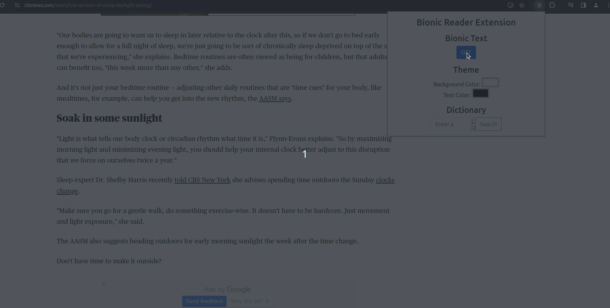

# Bionic Reader: Transforming Articles into Effortless Reading 

### Team Members
- Jack Archibald (Project Lead)
- Jared Reiss-Lavoie
- Jacob Larsen
- Matthew Gehrt
- Bao Xiong

### Project Description
Bionic Reader is a Chrome extension designed to revolutionize your online reading experience. The Bionic Reader will transform text by bolding the most concise parts to help guide your eyes over text. Say goodbye to endless scrolling, eye strain, and the frustration of sifting through cluttered web pages. Bionic Reader is your gateway to a new world of effortless and immersive reading.

### Bionic Text Example


## Getting Started

### Prerequisites

There are no prerequisites

### Installation

1. Clone the repo
   ```sh
   git clone https://github.com/jackabald/Bionic-Reader-Chrome-Extension.git
   ```
2. Open Google Chrome and navigate to 'Manage Extensions'
3. In the upper right corner make sure you have entered 'Developer Mode'
4. Click 'Load unpacked'
5. Navigate through your files to the cloned repo and select
6. Enjoy effortless reading!
